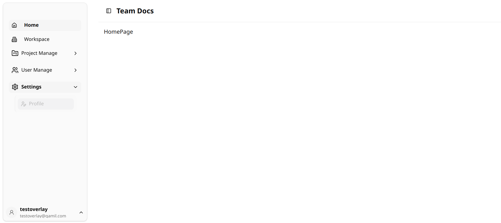
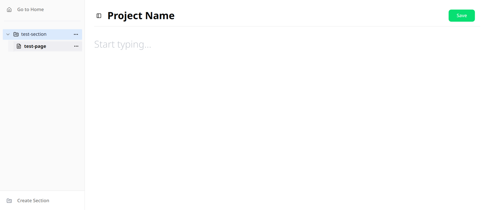

# 🧩 team-docs

> A collaborative documentation platform — powered by Next.js 15 (App Router) and rich modern stack.
>
> 📌 _Note: Project description and features will be added soon._

---

## 📦 Tech Stack

- **Framework**: Next.js 15 (App Router)
- **Database**: PostgreSQL (via Docker)
- **ORM**: Prisma
- **Package Manager**: Bun
- **Styling**: Tailwind CSS v4
- **UI Library**: ShadCN UI
- **Editor**: Tiptap (rich text editing)
- **State Management**: Zustand
- **Forms & Validation**: React Hook Form + Zod
- **Icons**: Lucide React Icons
- **Environment**: Dockerized setup for consistent local dev

---

## 🛠️ Setup Instructions

Follow these steps to get the app running on your local machine.

---

### 1. 🥖 Install Bun

Install **Bun** globally. You can use **npm** or the **official script**:

#### For Windows / WSL:

```bash
npm install -g bun
```

or:

```bash
curl -fsSL https://bun.sh/install | bash
```

💡 After install, restart your terminal and run `bun --version` to verify installation.

### 2. 🐳 Install Docker

Docker is required to run the database in a containerized environment.

🔹 For Windows:
Download and install [Docker Desktop](https://docs.docker.com/desktop/setup/install/windows-install/).

Start Docker Desktop and make sure it is running (check the taskbar icon).

> 💡 You must manually start Docker Desktop before running Docker commands.

🔹 For Linux:

```bash
# Install Docker
curl -fsSL https://get.docker.com | bash

# Add your user to the docker group to run without sudo (optional but recommended)
sudo usermod -aG docker $USER
newgrp docker
```

### 3. 📄 Create .env File

```bash
cp .env.example .env
```

### 4. 📦 Install Dependencies (with Bun)

```bash
bun install
```

> ⚠️ If `bun install` takes too long or stalls at postinstall, you can temporarily comment out the `postinstall` script in `package.json` to speed things up:

```json
"scripts": {
  // "postinstall": "prisma generate"
}
```

### 5. 🐳 Start PostgreSQL + App with Docker

```bash
docker compose up
```

### 🌐 Visit the App

```bash
http://localhost:3000
```

# ✅ You're all set!

The app should now be running in development mode with Docker and Bun.

---

# view the database

### credentials

```
host: localhost
port: 5432
user: mazumder
password: 1234
```

---

# 🖼️ Screenshots

### homepage



### project page editor


