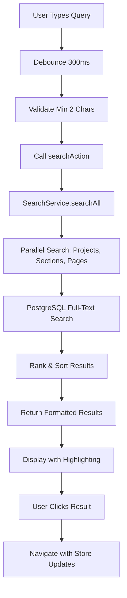

# 🧩 Team-Docs - Comprehensive Documentation

> A collaborative documentation platform built with Next.js 15, PostgreSQL, and modern web technologies.

## 📋 Table of Contents

- [Project Overview](#project-overview)
- [Architecture & Tech Stack](#architecture--tech-stack)
- [Features Documentation](#features-documentation)
- [Search System](#search-system)
- [Authentication & Authorization](#authentication--authorization)
- [Database Schema](#database-schema)
- [API Documentation](#api-documentation)
- [Development Guide](#development-guide)

---

## 🎯 Project Overview

Team-Docs is a modern collaborative documentation platform designed for teams to create, organize, and share knowledge efficiently. Built with Next.js 15 App Router, it provides a Notion-like editing experience with advanced search capabilities, role-based access control, and workspace management.

### Key Objectives

- **Collaborative Writing**: Real-time rich text editing with TipTap
- **Intelligent Organization**: Projects → Sections → Pages hierarchy
- **Advanced Search**: Full-text search across all content types
- **Access Control**: Granular permissions and role management
- **Modern UX**: Responsive design with smooth animations

---

## 🏗️ Architecture & Tech Stack

### Frontend Stack

- **Framework**: Next.js 15 (App Router)
- **Styling**: Tailwind CSS v4
- **UI Components**: Shadcn UI
- **Icons**: Lucide React
- **Animations**: Framer Motion
- **State Management**: Zustand + React Context
- **Forms**: React Hook Form + Zod validation

### Backend Stack

- **Database**: PostgreSQL (Dockerized)
- **ORM**: Prisma with custom extensions
- **Authentication**: NextAuth.js with JWT
- **Package Manager**: Bun
- **Deployment**: Vercel

### Development Tools

- **Environment**: Docker Compose
- **Code Quality**: ESLint + Prettier
- **Type Safety**: TypeScript patterns
- **Performance**: React 18 concurrent features

---

## 🚀 Features Documentation

### Core Features

#### 1. **Workspace Management**

- Multi-tenant architecture with workspace isolation
- Workspace approval system for admin control
- Owner-based access control and member management
- Workspace settings and customization options

#### 2. **Project Organization**

- Hierarchical structure: Workspace → Projects → Sections → Pages
- Project-level permissions and member assignments
- Rich metadata support (icons, colors, descriptions)
- Archive and status management

#### 3. **Rich Text Editing**

- TipTap-based Notion-like editor
- Slash commands for quick formatting
- Collapsible blocks and advanced formatting
- Real-time content saving and versioning

#### 4. **Advanced Search System**

- Full-text search across projects, sections, and pages
- PostgreSQL-powered search with intelligent ranking
- Real-time search with debouncing
- Keyboard shortcuts and accessibility features

#### 5. **Role-Based Access Control (RBAC)**

- Granular permission system
- Project-level and workspace-level roles
- Custom role creation and management
- Permission inheritance and overrides

#### 6. **User Management**

- User registration and authentication
- Profile management and settings
- Activity tracking and audit logs
- Super admin capabilities

---

## 🔍 Search System

### Overview

The search system is one of the most sophisticated features, providing comprehensive full-text search across all content types with intelligent ranking and real-time results.

### Architecture Components

#### 1. **SearchService** (`src/system/Services/SearchService.js`)

- **Purpose**: Core search logic and database queries
- **Features**: PostgreSQL full-text search with ILIKE fallback
- **Scope**: Workspace-limited searches for security
- **Performance**: Optimized queries with proper indexing

#### 2. **SearchDialog** (`src/app/(home)/search/components/SearchDialog.jsx`)

- **Purpose**: Main search interface component
- **Features**: Real-time search, debouncing, result highlighting
- **UX**: Responsive design with keyboard navigation
- **State**: Zustand integration for navigation

#### 3. **SearchButton** (`src/app/(home)/search/components/SearchButton.jsx`)

- **Purpose**: Search trigger with keyboard shortcuts
- **Features**: Ctrl+K/Cmd+K support, responsive design
- **Integration**: Global header placement

#### 4. **Search Actions** (`src/app/(home)/search/actions/searchAction.js`)

- **Purpose**: Server actions for search operations
- **Features**: Input validation, error handling
- **Security**: Session validation and workspace scoping

### Search Flow



### Search Implementation Details

#### Database Queries

- **Full-Text Search**: Uses `to_tsvector()` and `to_tsquery()` with English language support
- **Prefix Matching**: Implements `:*` suffix for partial word matching
- **Fallback Strategy**: ILIKE pattern matching when full-text search fails
- **Ranking**: `ts_rank()` for relevance scoring

#### Performance Optimizations

- **Result Limits**: 10 projects, 10 sections, 15 pages per search
- **Debouncing**: 300ms delay to prevent excessive API calls
- **Concurrent Features**: React 18 useTransition for non-blocking UI
- **Workspace Scoping**: Prevents cross-workspace data leaks

#### Search Targets

1. **Projects**: name, description fields
2. **Sections**: name, description fields
3. **Pages**: title, description, TipTap JSON content

### Usage Examples

#### Basic Search

```javascript
// Trigger search programmatically
const results = await searchAction("project name", { limit: 10 });
```

#### Navigation Integration

```javascript
// Navigate to search result with store updates
navigateToSearchResult(result, router, { setSelectedSection, setSelectedPage });
```

---

## 🔐 Authentication & Authorization

### Authentication System

- **Provider**: NextAuth.js with credentials provider
- **Strategy**: JWT tokens with secure session management
- **Password**: bcrypt hashing with salt rounds
- **Session**: Server-side session validation

### Authorization Levels

1. **Super Admin**: Full system access
2. **Workspace Owner**: Workspace management
3. **Project Members**: Project-specific permissions
4. **Viewers**: Read-only access

### Permission System

- **Granular Permissions**: Create, read, update, delete operations
- **Scope-Based**: Workspace, project, and resource-level permissions
- **Role Inheritance**: Hierarchical permission structure
- **Dynamic Roles**: Custom role creation and assignment

---

## 📊 Database Schema

### Core Models

#### User Model

```prisma
model User {
  id          String   @id @default(cuid())
  username    String   @unique
  email       String   @unique
  password    String
  status      UserStatus   @default(ACTIVE)
  workspaceId String?
  isSuperAdmin Boolean @default(false)
  // ... relationships
}
```

#### Workspace Model

```prisma
model Workspace {
  id          String   @id @default(cuid())
  name        String
  slug        String
  description String?
  status      WorkspaceStatus @default(PENDING)
  ownerId     String   @unique
  // ... relationships
}
```

#### Project Model

```prisma
model Project {
  id          String   @id @default(cuid())
  name        String
  slug        String
  description String?
  workspaceId String
  ownerId     String
  status      ProjectStatus @default(ACTIVE)
  // ... relationships
}
```

### Relationships

- **User** → **Workspace** (one-to-many)
- **Workspace** → **Project** (one-to-many)
- **Project** → **Section** (one-to-many)
- **Section** → **Page** (one-to-many)

---

## 🛠️ Development Guide

### Setup Instructions

1. **Install Bun**: `curl -fsSL https://bun.sh/install | bash`
2. **Clone Repository**: `git clone <repo-url>`
3. **Install Dependencies**: `bun install`
4. **Setup Environment**: Copy `.env.example` to `.env`
5. **Start Database**: `docker compose up -d postgres`
6. **Run Migrations**: `bun run db:migrate`
7. **Start Development**: `bun run dev`

### Code Conventions

- **Components**: PascalCase with descriptive names
- **Services**: Laravel-like class structure
- **Hooks**: Custom hooks in `src/hooks/`
- **Utilities**: Pure functions in `src/utils/`
- **Types**: TypeScript interfaces and types

### Performance Guidelines

- **Server Components**: Default choice for better performance
- **Client Components**: Only when interactivity is required
- **Dynamic Imports**: Lazy loading for heavy components
- **Image Optimization**: Next.js Image component
- **Caching**: Implement proper caching strategies

---

## 📈 Future Enhancements

### Planned Features

- **Real-time Collaboration**: WebSocket-based live editing
- **Advanced Analytics**: Usage tracking and insights
- **API Integration**: External service connections
- **Mobile App**: React Native companion app
- **AI Features**: Content suggestions and auto-completion

### Technical Improvements

- **Search Enhancement**: Elasticsearch integration
- **Performance**: Edge caching and CDN optimization
- **Security**: Advanced threat protection
- **Monitoring**: Comprehensive logging and alerting
- **Testing**: Automated testing suite

---

_This documentation is continuously updated as the project evolves. For the latest information, refer to the source code and commit history._
