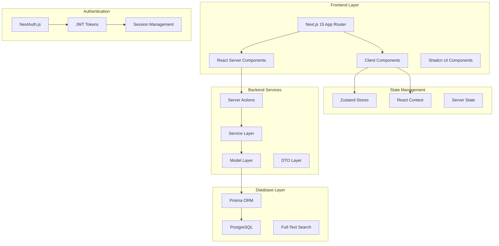
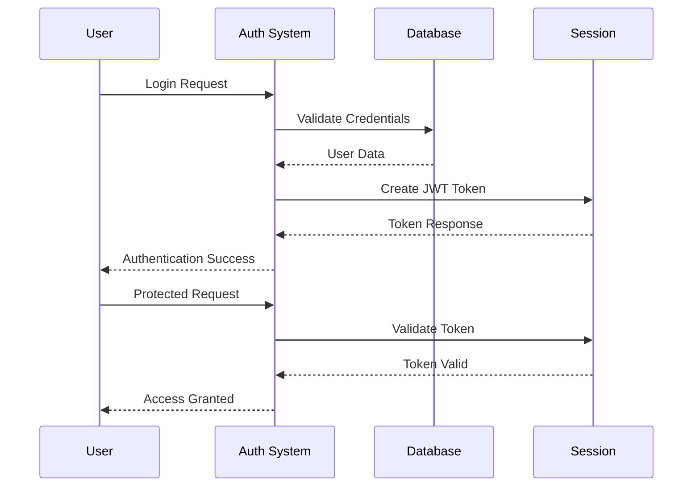

# 🏗️ Team-Docs Architecture Documentation

## System Overview

Team-Docs is built using a modern, scalable architecture that emphasizes performance, security, and developer experience. The system follows Next.js 15 App Router patterns with a service-oriented backend architecture.

## Architecture Diagram



## Technology Stack

### Frontend Technologies
- **Framework**: Next.js 15 with App Router
- **React Version**: React 18 with concurrent features
- **Styling**: Tailwind CSS v4
- **UI Library**: Shadcn UI components
- **Icons**: Lucide React
- **Animations**: Framer Motion
- **Forms**: React Hook Form + Zod validation

### Backend Technologies
- **Runtime**: Node.js with Bun package manager
- **Database**: PostgreSQL with Docker
- **ORM**: Prisma with custom extensions
- **Authentication**: NextAuth.js with JWT
- **File Storage**: Local filesystem (cloud storage planned)

### Development Tools
- **Package Manager**: Bun
- **Code Quality**: ESLint + Prettier
- **Type Safety**: TypeScript patterns
- **Containerization**: Docker Compose
- **Deployment**: Vercel

## Directory Structure

```
team-docs/
├── src/
│   ├── app/                    # Next.js App Router
│   │   ├── (auth)/            # Auth route group
│   │   ├── (home)/            # Main app route group
│   │   ├── (admin)/           # Admin route group
│   │   └── api/               # API routes
│   ├── components/            # Shared components
│   │   ├── ui/               # Shadcn UI components
│   │   └── editor/           # TipTap editor components
│   ├── system/               # Backend architecture
│   │   ├── Services/         # Business logic services
│   │   ├── Models/           # Database models
│   │   ├── DTOs/             # Data transfer objects
│   │   └── Utils/            # Utility functions
│   ├── lib/                  # Shared libraries
│   ├── hooks/                # Custom React hooks
│   └── utils/                # Frontend utilities
├── prisma/                   # Database schema and migrations
├── docs/                     # Documentation
└── docker-compose.yml        # Development environment
```

## Service Architecture

### Laravel-Inspired Service Pattern

The backend follows a Laravel-inspired architecture with clear separation of concerns:

```javascript
// Service Layer Structure
BaseService
├── UserServices
├── ProjectService
├── WorkspaceService
├── SearchService
├── PermissionServices
└── ...other services

// Each service extends BaseService
export class ProjectService extends BaseService {
  static modelName = "project";
  static dto = ProjectDTO;
  
  static async getResource({ id, slug }) {
    // Business logic implementation
  }
}
```

### Data Transfer Objects (DTOs)

DTOs provide consistent data formatting and validation:

```javascript
export class ProjectDTO {
  static toResponse(project) {
    return {
      id: project.id,
      name: project.name,
      slug: project.slug,
      description: project.description,
      // ... formatted response
    };
  }
  
  static fromRequest(data) {
    // Validate and transform request data
    return validatedData;
  }
}
```

## Database Architecture

### Schema Design

The database follows a hierarchical structure optimized for multi-tenant usage:

```
User
├── Workspace (1:1)
    ├── Projects (1:N)
        ├── Sections (1:N)
            ├── Pages (1:N)

Permissions
├── Roles (N:M)
├── WorkspaceMembers (N:M)
├── ProjectMembers (N:M)
```

### Key Design Principles

1. **Multi-tenancy**: Workspace-scoped data isolation
2. **Hierarchical Permissions**: Inherited access control
3. **Soft Deletes**: Data preservation with archive flags
4. **Audit Trails**: Created/updated timestamps on all entities
5. **Flexible Metadata**: JSON fields for extensible properties

### Performance Optimizations

- **Indexes**: Strategic indexing on frequently queried fields
- **Full-Text Search**: PostgreSQL native search capabilities
- **Connection Pooling**: Prisma connection management
- **Query Optimization**: Raw SQL for complex operations

## Authentication & Authorization

### Authentication Flow



### Authorization Layers

1. **Route Protection**: Middleware-based route guards
2. **Component Protection**: Server component access checks
3. **Data Protection**: Service-layer permission validation
4. **API Protection**: Server action authorization

## State Management Strategy

### Client-Side State

```javascript
// Zustand for complex client state
const useProjectStore = create((set) => ({
  selectedProject: null,
  selectedSection: null,
  selectedPage: null,
  setSelectedProject: (project) => set({ selectedProject: project }),
  // ... other actions
}));

// React Context for app-wide state
const ThemeContext = createContext();
const AuthContext = createContext();
```

### Server-Side State

- **Server Components**: Default for data fetching
- **Server Actions**: Form handling and mutations
- **Caching**: Next.js built-in caching strategies
- **Session State**: NextAuth.js session management

## Performance Architecture

### Frontend Performance

1. **Server Components**: Reduced client-side JavaScript
2. **Dynamic Imports**: Code splitting for large components
3. **Image Optimization**: Next.js Image component
4. **Concurrent Features**: React 18 useTransition and Suspense

### Backend Performance

1. **Database Optimization**: Efficient queries and indexing
2. **Caching Strategy**: Multiple caching layers
3. **Connection Pooling**: Optimized database connections
4. **Query Batching**: Reduced database round trips

### Monitoring & Observability

```javascript
// Custom Logger implementation
export class Logger {
  static info(message, context) {
    console.log(`[INFO] ${context}: ${message}`);
  }
  
  static error(message, context) {
    console.error(`[ERROR] ${context}: ${message}`);
  }
}
```

## Security Architecture

### Security Layers

1. **Input Validation**: Zod schemas for all inputs
2. **SQL Injection Prevention**: Parameterized queries
3. **XSS Protection**: Content sanitization
4. **CSRF Protection**: Built-in Next.js protection
5. **Session Security**: Secure JWT implementation

### Data Protection

- **Workspace Isolation**: Multi-tenant data separation
- **Permission Checks**: Granular access control
- **Audit Logging**: Comprehensive activity tracking
- **Secure Headers**: Security headers on all responses

## Deployment Architecture

### Development Environment

```yaml
# docker-compose.yml
services:
  postgres:
    image: postgres:15
    environment:
      POSTGRES_DB: teamdocs
      POSTGRES_USER: mazumder
      POSTGRES_PASSWORD: 1234
    ports:
      - "5432:5432"
  
  app:
    build: .
    ports:
      - "3000:3000"
    depends_on:
      - postgres
```

### Production Deployment

- **Platform**: Vercel for Next.js optimization
- **Database**: Managed PostgreSQL (Supabase/Neon)
- **CDN**: Vercel Edge Network
- **Monitoring**: Built-in Vercel analytics

## Scalability Considerations

### Horizontal Scaling

1. **Stateless Architecture**: No server-side session storage
2. **Database Scaling**: Read replicas and connection pooling
3. **CDN Integration**: Static asset distribution
4. **Microservices Ready**: Service-oriented architecture

### Vertical Scaling

1. **Database Optimization**: Query performance tuning
2. **Caching Layers**: Redis integration (planned)
3. **Background Jobs**: Queue system for heavy operations
4. **Resource Monitoring**: Performance metrics tracking

## Future Architecture Plans

### Short-term Improvements

1. **Redis Caching**: Implement Redis for session and data caching
2. **Background Jobs**: Queue system for email and notifications
3. **File Storage**: Cloud storage integration (AWS S3/Cloudflare R2)
4. **API Gateway**: Centralized API management

### Long-term Vision

1. **Microservices**: Service decomposition for better scalability
2. **Event-Driven Architecture**: Real-time collaboration features
3. **Multi-Region Deployment**: Global content distribution
4. **AI Integration**: Machine learning for content suggestions

---

*This architecture documentation reflects the current system design and planned improvements. For implementation details, refer to the source code and other documentation files.*
